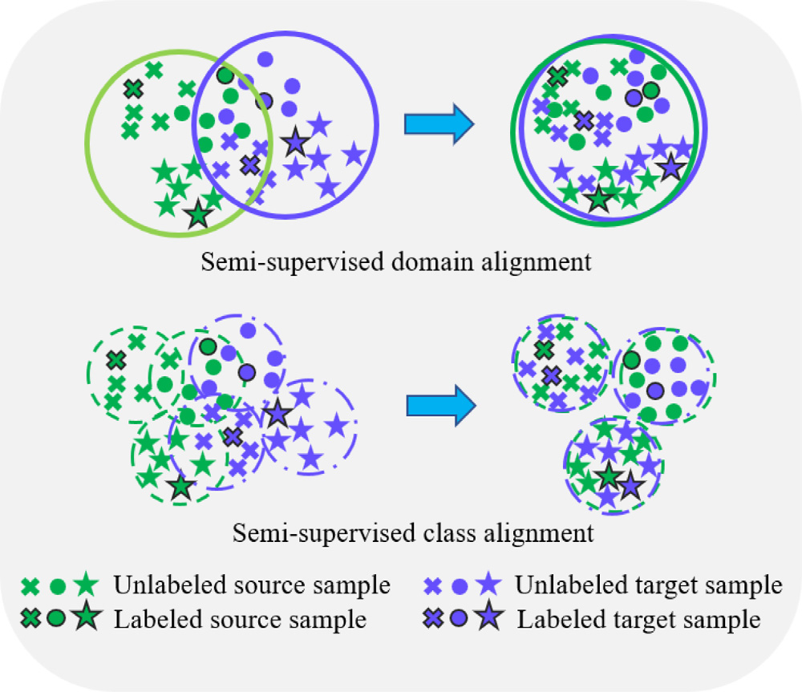
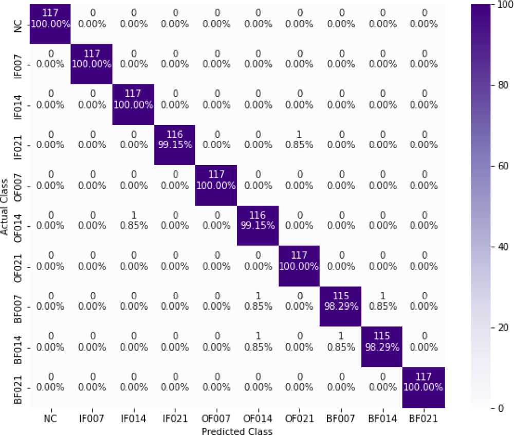

# CARMA-DACA — Class-Alignment Graph Convolution for Bearing Fault Diagnosis with Missing Data

> A semi-supervised deep learning framework for rolling-element bearing fault
> diagnosis that stays accurate under **changing working conditions**, **scarce
> labels**, and **heavy missing data** — even when **75% of the target signal is
> lost** to multi-rate sensor sampling.

📄 **Paper:** *A class alignment method based on graph convolution neural network
for bearing fault diagnosis in presence of missing data and changing working
conditions*
*Measurement* **199** (2022) 111536 · [doi:10.1016/j.measurement.2022.111536](https://doi.org/10.1016/j.measurement.2022.111536)

👥 Mohammadreza Kavianpour, Amin Ramezani, Mohammad T. H. Beheshti

---

## TL;DR

Real machinery rarely gives you clean, fully-labeled, complete vibration data:
operating conditions drift, labels are expensive, and sensors sampling at
different rates leave large gaps in the signal. **CARMA-DACA** tackles all three
at once with a single end-to-end model:

1. **CNN + ARMA-GCN feature extractor.** A CNN captures spatial features, then a
   Graph Convolutional Network with **ARMA filters** models the *structural*
   relationships between signal segments — flexible frequency response, fewer
   parameters, and lower noise sensitivity than the polynomial/Chebyshev filters
   used in prior GCN work.
2. **Adversarial domain adaptation** aligns the *global* distributions of the
   source and target domains.
3. **MK-LMMD class alignment** goes further and aligns *each class's subdomain*
   across domains, so a sample from one class doesn't drift next to another after
   adaptation.

The combination of structural features + global alignment + per-class alignment
is exactly what lets the model absorb the distribution gap created by missing
data and changing conditions. On **CWRU**, CARMA-DACA leads across unsupervised
and semi-supervised settings (1%, 5%, 10% labels).

> ⚠️ **Status — documentation & resources only.** This repository currently hosts
> the method overview, problem framing, figures, and dataset pointers. The
> training code is not yet public. See [Roadmap](#roadmap).

---

## The framework


*Five blocks. **Input** feeds source + target data into a **spatial feature**
CNN (4 conv layers) and a **structural feature** GCN (graph generation + 3 ARMA
layers). The structured features then go to three heads: a **domain adaptation**
block (FC1–FC3, adversarial), a **class alignment** block (FC4–FC5, MK-LMMD), and
a **classifier** (FC6). Colored arrows show how each loss back-propagates.*

A detailed walkthrough lives in [`docs/method.md`](docs/method.md).

---

## Why this is hard — three coupled challenges

| Challenge | What goes wrong | How CARMA-DACA responds |
|---|---|---|
| **Changing working conditions** | Train/test distributions differ (load, speed) → plain DL accuracy collapses. | Adversarial **domain adaptation** + **MK-LMMD** class alignment. |
| **Scarce labels** | Labeling everything is costly; most industrial data is unlabeled. | **Semi-supervised** setup: works at 0%, 1%, 5%, 10% target labels. |
| **Missing data** | Multi-rate sampling drops up to 75% of target points; deletion/imputation waste information or assume structure. | **ARMA-GCN** structural features + alignment absorb the gap directly. |

Full discussion in [`docs/challenges.md`](docs/challenges.md).

---

## Two key ideas

### Domain alignment vs. class alignment



*Standard semi-supervised **domain** alignment (top) pulls the two domains
together globally — but classes can still overlap, so a sample can land next to
the wrong class and be misclassified. **Class** alignment (bottom) instead
matches each class's subdomain across domains, keeping classes cleanly
separated. CARMA-DACA does both.*

### ARMA-GCN structural features

Prior GCN diagnosis methods use polynomial / Chebyshev spectral filters, which
are smooth (can't model sharp frequency changes), need high orders to reach
distant neighbors (raising cost), and overfit graph frequencies (hurting
transfer). CARMA-DACA's **ARMA graph filter** gives a flexible frequency response
with fewer learnable parameters, lower noise sensitivity, and — because it
doesn't explicitly depend on eigenvalues/eigenvectors — better transferability
across graphs. It's computed with an efficient recursive approximation.

---

## Headline results

### Near-perfect classification despite missing data



*Confusion matrix on task D1→D2 with only 10% labels and 75% missing target data
(10 CWRU health states). The model labels six classes perfectly and never drops
below 98.29% on the rest — 1164 of 1170 samples correct.*

### The numbers

- **Robust to missing data:** under 75% target missingness, on the closed-condition
  tasks (C1→C2, D1→D2), CARMA-DACA leads at every label budget — e.g. **99.78%**
  at 10% labels — beating WDCNN, DTLCNN, DSACNN, HDAN, DAGCN, and the CARMA-M /
  CARMA-C ablations.
- **Robust to changing conditions:** across six cross-condition tasks, it posts
  the best average accuracy — e.g. **57.58%** unsupervised vs. 44.91% for a plain
  CNN — and on the hard A1→D2 task beats the best graph / DA / DL baselines by
  **0.47% / 3.78% / 13.21%**.
- **Class alignment matters:** swapping MK-LMMD for MK-MMD (CARMA-M) or CORAL
  (CARMA-C) lowers accuracy and raises the measured A-/AL-distance — confirming
  per-class alignment is what closes the subdomain gap.
- **Statistically significant:** a Friedman + Nemenyi test (CD = 2.45, α = 0.05,
  24 tasks) ranks CARMA-DACA **first**.

See [`docs/method.md`](docs/method.md) for the full training setup.

---

## Datasets

Evaluated on the **CWRU** benchmark, with the missing-data and cross-condition
protocol described in [`docs/datasets.md`](docs/datasets.md). **No data is
redistributed here.**

| Property | Value |
|---|---|
| Source domain | 12 kHz drive-end sensor (loads A1–D1) |
| Target domain | 48 kHz sensor → 75% of points dropped (C2, D2) |
| Health states | 10 — NC + {IF, OF, BF} × 3 severities (0.007/0.014/0.021 in.) |
| Label budgets | 0%, 1%, 5%, 10% labeled target data |

---

## Repository contents

```
.
├── README.md               # you are here
├── assets/                 # figures extracted from the paper
├── docs/
│   ├── method.md           # CNN + ARMA-GCN, MK-LMMD, adversarial DA, training
│   ├── challenges.md       # the three coupled challenges, in depth
│   └── datasets.md         # CWRU + missing-data / cross-condition task design
├── CITATION.cff            # machine-readable citation
└── LICENSE                 # docs/figures license
```

---

## Roadmap

- [x] Method overview, problem framing, and figures
- [x] Dataset documentation and transfer-task design
- [ ] Reference implementation (PyTorch) of CARMA-DACA
- [ ] ARMA-GCN backbone + graph generation layer + MK-LMMD module
- [ ] Multi-rate / missing-data simulation utility
- [ ] Reproduction scripts for the CWRU experiments

---

## Citation

If you find this work useful, please cite the paper (see [`CITATION.cff`](CITATION.cff)):

```bibtex
@article{kavianpour2022carmadaca,
  title   = {A class alignment method based on graph convolution neural network
             for bearing fault diagnosis in presence of missing data and
             changing working conditions},
  author  = {Kavianpour, Mohammadreza and Ramezani, Amin and
             Beheshti, Mohammad T. H.},
  journal = {Measurement},
  volume  = {199},
  pages   = {111536},
  year    = {2022},
  doi     = {10.1016/j.measurement.2022.111536}
}
```

---

## License & figures

Text and documentation in this repository are released under the terms in
[`LICENSE`](LICENSE). The figures in `assets/` are reproduced from the published
article (© 2022 Elsevier Ltd.) and are included here solely to document and
explain the authors' own work; all rights remain with the copyright holder.
