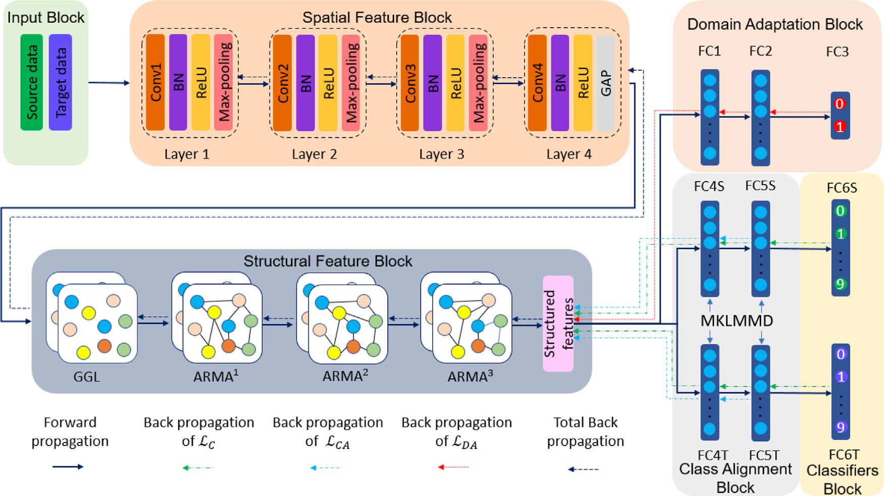

# Method — CARMA-DACA in detail

This document expands on the CARMA-DACA framework: the feature extractor (CNN +
ARMA-GCN), the three loss terms (classification, adversarial domain adaptation,
MK-LMMD class alignment), and the training setup. It mirrors the paper's
Section 3.



---

## 1. Setting (semi-supervised)

We have a fully labeled **source domain** `Ds = {(x_s,i, y_s,i)}` and a **target
domain** split into a small labeled part `Dt^l` and a large unlabeled part
`Dt^u`. The domains share the same `n_c` classes but come from different
distributions (`ps ≠ pt`). The shift here is compounded: **changing working
conditions** (different load/speed) *and* **missing data** (multi-rate sampling
drops target points). The goal is high target accuracy from very few target
labels.

---

## 2. Feature extractor: CNN + ARMA-GCN

The architecture (paper Table 1) stacks a spatial CNN and a structural GCN:

| Block | Layers | Output |
|---|---|---|
| **Spatial (CNN)** | 4× (Conv → BN → ReLU → pool), kernels 16→32→64→128, GAP last | structural node features |
| **Structural (GCN)** | Graph Generation Layer → ARMA1 (128) → ARMA2 (256) → ARMA3 (256) | structured features |
| **Domain adaptation** | FC1 (128) → FC2 (128) → FC3 (2) | domain logits |
| **Class alignment** | FC4 (128) → FC5 (128) | MK-LMMD on these |
| **Classifier** | FC6 → 10 health states | class logits |

**Graph generation.** After GAP, each mini-batch becomes an *instance graph*:
adjacency `A = normalize(X·Xᵀ)`, sparsified by keeping the **Top-K** entries per
row (K = 2) to cut cost.

**ARMA graph convolution.** Spectral filters are global, expensive, and tied to a
fixed Laplacian spectrum (so they don't transfer across graph structures). The
**ARMA** filter fixes this with a recursive first-order unit
`X̄^(t+1) = pF·X̄^(t) + qX` (with `F = ½(λmax − λmin)I − L`); higher orders are
built by summing K such units. Because it doesn't explicitly depend on
eigenvectors, it transfers better and resists noise. The conv operation used is
`X̃^(l+1) = ReLU(F̃·X̃^(l)·W + X̃·V)` with `λmax = 2, λmin = 0`. Three stacked
ARMA layers (each + ReLU + BN) produce the structured features.

> Setting the ARMA denominator coefficients `a_k = 0` reduces it to a polynomial
> filter — so ARMA strictly generalizes the polynomial GCNs used in prior work.

---

## 3. Three optimization objectives

### (1) Classification loss `L_C`

Cross-entropy on **both** the labeled source and the few labeled target samples,
using the FC6 softmax outputs — pulling predictions toward the true classes in
both domains.

### (2) Adversarial domain adaptation `L_DA`

A domain discriminator `D` is trained to tell source (0) from target (1) from the
structured features `F`; the feature extractor is trained adversarially to fool
it. This **global** min–max game aligns the two domains' overall distributions
and yields domain-invariant features.

### (3) MK-LMMD class alignment `L_CA`

This is the distinctive piece. **LMMD** extends MMD by weighting each sample by
its class, so the discrepancy is computed **per class (subdomain)** rather than
globally. Source weights use true labels; unlabeled target weights use
**pseudo-labels**. CARMA-DACA applies a **multi-kernel** version (a linear
combination of Gaussian kernels at bandwidths `{0.001, 0.01, 1, 10, 100}`, to
capture low- and high-order moments) across **two FC layers** (FC4, FC5) and sums
them. This is what keeps same-class samples from drifting next to other classes
after the global alignment.

### Total objective

```
L_total(Θf, Θc, Θd) = L_C(Θf, Θc)  −  α·L_DA(Θf, Θd)  +  β·L_CA(Θf)
```

Optimization is the usual two-step adversarial scheme: minimize `L_total` over
`Θf, Θc` (feature extractor + classifier), then maximize over `Θd` (discriminator)
— giving features that are both class-separable and domain-invariant.

---

## 4. Training setup

| Setting | Value |
|---|---|
| Optimizer | Adam |
| Epochs | 500 |
| Batch size | 128 |
| Learning rate | 0.001 |
| Trade-off α (domain) | 1 |
| Trade-off β (class align) | 0.05 |
| ARMA order | 3rd-order |
| MK-LMMD kernels | Gaussian, bandwidths {0.001, 0.01, 1, 10, 100} |
| Init | Xavier |
| Split | 80% train / 20% test |
| Repeats | 10 (to minimize randomness) |
| Framework | PyTorch |

The α, β sweep over `{0, 0.02, 0.05, 0.1, 0.5, 1}` peaks at **α = 1, β = 0.05**
(e.g. 69.58% on A1→D2 @ 1% labels); with **α = β = 0** the model collapses to the
plain CARMA baseline (62.44%), quantifying how much the transfer-learning modules
contribute.

---

## 5. Evaluation

Primary metric is **classification accuracy** (averaged over 10 runs), reported
across label budgets 0% / 1% / 5% / 10%. Alignment quality is additionally
checked with two distances (lower = better):

- **A-distance** `d_A = 2(1 − 2ξ)` — global, from an SVM separating source/target.
- **Aₗ-distance** `d_AL = 2·Σ_c p(c)(1 − 2ξ_c)` — per-class (subdomain) version.

t-SNE visualizations across layers (input → GAP → ARMA3 → FC6) show the features
progressing from tangled to class-separable and domain-invariant. A Friedman +
post-hoc Nemenyi test (CD = 2.45, α = 0.05, 24 tasks) confirms CARMA-DACA's
first-place ranking is statistically significant.
